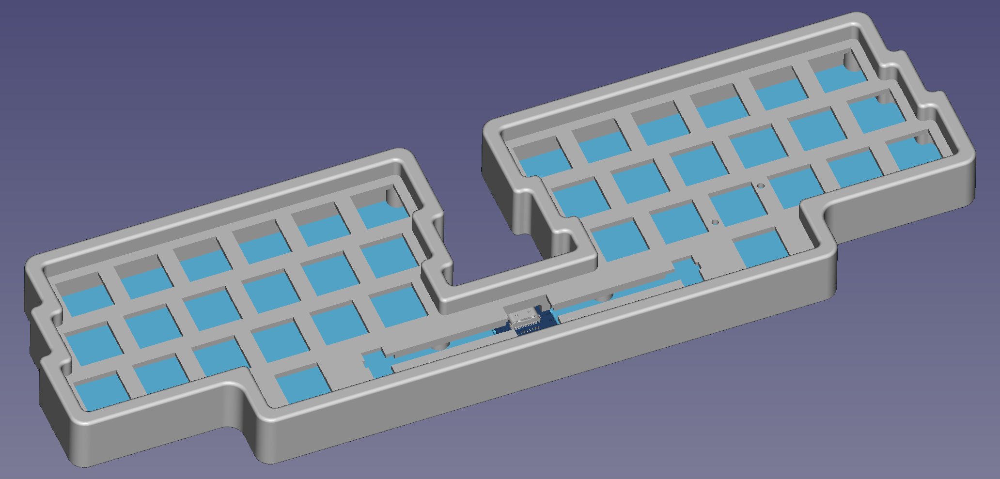

# BGKatana

**CAUTION**: This board has yet to be built and adjustments may be needed.

BGKatana is a case for a hand-wired monoblock split keyboard with a “katana”-style
(symmetric row-stagger) layout. It is based on the [ScottoKatana] case but has six
columns on each side instead of five, uses a centre-mounted [RP2040-Zero] instead of an
offset Pro Micro, and is built in FreeCAD instead of Shapr3D. Additionally, BGKatana
supports my [nav. switch mount PCB] on the bottom row below the middle finger.

The FreeCAD model is heavily parameterised. Go to the document’s *Spreadsheet* to adjust
various settings, including: the width of the central spacebar, the width of the side
modifier keys, the distance between the two sides, key spacing, height of walls, and more.

## Bill of Materials

  * 1 × BGKatana case top
  * 1 × BGKatana case base
  * 1 × Waveshare [RP2040-Zero] controller board
  * 39\* × MX switches
  * 39\* × 1N4148 THT diodes
  * 10 × M2 heat-set inserts
  * 10 × M2×5–6mm screws
  * 1 × 6¼U plate mount stabiliser
  * 36\* × 1U MX keycaps
  * 2 × 1½U MX keycaps
  * 1 × 6¼U MX centre-mount spacebar
  * 8 × ≤10mm adhesive bumpers
  * Approximately 2½m of wire

#### Optional

If mounting a 5-way navigation switch, use one fewer of the asterisked\* components and
include the following:

  * 1 × [ALPS SKQUCAA010] (or equivalent) navigation switch
  * 1 × [nav. switch mount PCB]
  * 5 × 1N4841 SOD-123 SMD diodes
  * 2 × additional M2 screws
  * 2 × M2 nuts

See the [nav. switch PCB page][nav-caps] for information on keycaps for the 5-way switch.

## Wiring

TBC

## Bill of Materials

TBC

[ScottoKatana]: https://scottokeebs.com/blogs/keyboards/scottokatana-handwired-keyboard
[RP2040-Zero]: https://www.waveshare.com/rp2040-zero.htm
[nav. switch mount PCB]: https://github.com/bgkendall/nav-switch-mount
[ALPS SKQUCAA010]: https://tech.alpsalpine.com/e/products/detail/SKQUCAA010/
[nav-caps]: https://github.com/bgkendall/nav-switch-mount#keycaps
